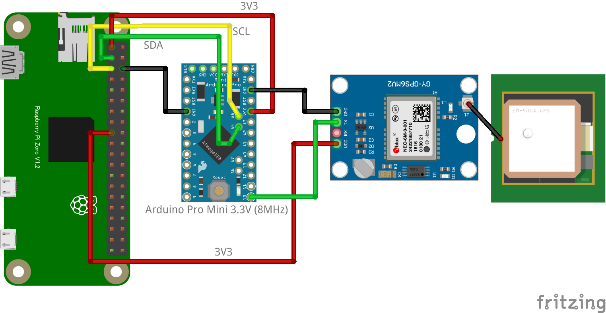

# I2CGPS

これは一般的なGPSレシーバ (GY-NEO6MV2など、UART 9600bpsでNMEA0183形式のデータを出力する。3.3Vでも動くもの) をI2Cインターフェースで使用できるようにするものです。メインコンピューターのUARTに余裕がないときに便利かもしれません。Arduino Mini Pro 3.3V (8MHz)でI2Cに変換しています。GY-NEO6MV2+CHIRIMEN PiZero環境で動作確認をしました。

https://github.com/ckuethe/i2cgps　をフォークして開発しました。そのため、i2cのインターフェース仕様はフォーク元に準じます。
ただ、私のArduino環境ではオリジナルのソース(.ino)はうまく動かなかったので一度作り直しています。

また、以下を追加しています。
* [chirimen](https://www.chirimen.org)用のドライバとサンプル：[chirimen](./chirimen/)ディレクトリ
* 実体配線図：[hardware](./hardware)
* 未検証ですが・・KiCadのプリント基板設計図：[hardware/kiCad](./hardware/kiCad)

## 準備するもの
* GPSレシーバ(GY-NEO6MV2で確認しています)
* Arduiono Pro Mini 3.3V (8MHz) （もしくはその互換ボード）：この配線図通りで動かすには3.3V版が必要です
* [Chirimen Pi Zero 環境](https://tutorial.chirimen.org/pizero/)

## 動かし方
* ファームウェアの書き込み：Arduino Mini Pro 3.3V(もしくはその互換ボード)にUSB-シリアル(専用のものが安価に流通しています)に、ArduinoIDEで[i2cgps.ino](./i2cgps.ino)を書き込みます
* 実体配線図のようにつなぎます
* GPSレシーバが測位できていなくても、空のデータが送信されてくるため、Arduino側のLEDは点滅するはずです（点滅していないときはどこかに問題がある）
* 測位できるとGPSレシーバ側のLEDも点滅します(GY-NEO6MV2の場合)
* chirimen piZero環境で[サンプルコード(ドライバ付き)](./chirimen/main.js)を実行すると、データが出力されます

## 実体配線図

## ライセンス
ライセンスは原作者さんが明示していないので・・・　[The TAPR Open Hardware License](https://tapr.org/the-tapr-open-hardware-license/)を提示しておきます。

---

## 以下は原作者 (ckuetheさん)の作成されたREADMEです。

From time to time you want to attach a GPS to a microcontroller and
you're already using all the serial ports. Luckily we have another bus:
I2C. You could call it a kind of a controller-area-network, given that
there are master and slave devices, each of which has a unique address.

Unfortunately there are very few commercial
[I2C GPS](https://www.sparkfun.com/products/14414) receivers and they
just do NMEA over I2C. There are
[other projects](http://www.technoblogy.com/show?1LJI) that do something similar, but with a higher part count. 

This particular implementation rather wastefully uses an ATmega, eg. an
Arduino Nano.

### TODO

* port this to attiny85, eg. digispark

### Other Links

* https://playground.arduino.cc/Code/USIi2c/
* https://github.com/rambo/TinyWire/tree/master/TinyWireS
* https://github.com/lucullusTheOnly/TinyWire
* https://github.com/adafruit/TinyWireM
* https://github.com/harbaum/I2C-Tiny-USB/tree/master/digispark
* https://digistump.com/board/index.php?topic=2831.0
* https://digistump.com/board/index.php?topic=1147.0
* https://digistump.com/wiki/digispark/tutorials/lcd
